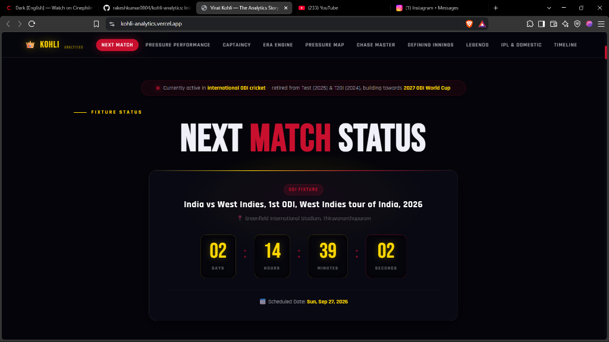
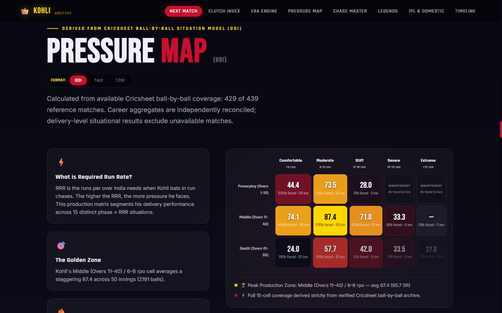
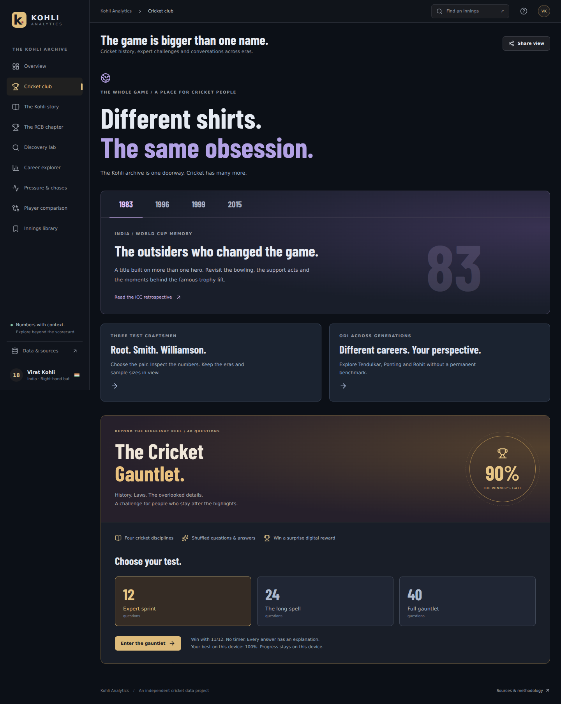
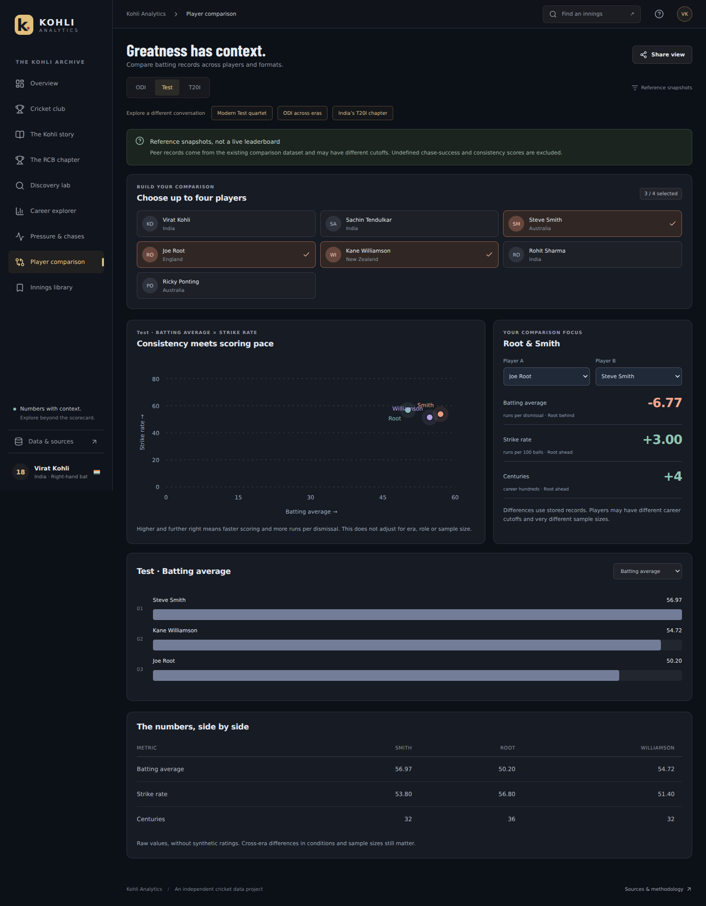

<](https://github.com/rakeshkumar0804/kohli-analytics/actions/workflows/ci.yml)
[](https://github.com/rakeshkumar0804/kohli-analytics/actions/workflows/auto-sync-stats.yml)


**[🌐 Live Site → kohli-analytics.vercel.app](https://kohli-analytics.vercel.app)**

</div>

---

## 📸 Screenshots

| Hero & Format Scope | Live Next Match Countdown |
| :---: | :---: |
|  |  |

| Legends Radar Showdown | 15-Cell Situational Pressure Map |
| :---: | :---: |
|  |  |

| Cricket Club | Player Comparison | RCB Chapter |
| :---: | :---: | :---: |
|  |  |  |

| Discovery Lab | Quiz on Mobile |
| :---: | :---: |
|  |  |

---

## ⚡ What Makes This Different

Most cricket dashboards display static career tables copied from statistics portals. This application **engineers original metrics** directly from ball-by-ball delivery archives and scorecard populations — every view dynamically recomputes populations, comparison baselines, and statistical distributions when you switch formats.

### Core Experiences

| Feature | Description |
|---|---|
| **🏏 Cricket Club** | World Cup chapters with ICC retrospectives, cross-generation comparison routes, and a 40-question Cricket Gauntlet with saved progress, answer explanations, and a downloadable SVG trophy |
| **🆚 Dual-Focus Comparison** | Select either focus player — including pairs without Kohli — across Test, ODI, and T20I presets with shareable URLs |
| **📊 687 Innings Archive** | 300 ODI + 112 T20I + 275 IPL batting innings with searchable scorecards, bowler matchups, bookmarks, and CSV exports |
| **🔴 The RCB Chapter** | 19 IPL seasons with scoring phases, opposition breakdown, and downloadable season cards |
| **🔬 Discovery Lab** | Innings mosaic, scoring patterns, winning chases, centuries, and personal collection |
| **📖 The Kohli Story** | 5 career eras with checkpoint replays, innings comparison, captaincy analysis, and rivalry deep-dives |

### Analytics & Visualizations

| Feature | Engineering Highlight |
|---|---|
| **Live Fixture Countdown** | Server-side CricAPI proxy with multi-strategy schedule discovery, rate limiting (30 req/min), and 15-min in-memory caching — zero browser secret exposure |
| **15-Cell Pressure Map** | D3.js heatmap (Match Phase × Required Run Rate) across 6,889 ODI and 1,525 T20I chase deliveries with zero-dismissal null handling |
| **Clutch Index** | Bounded Hyperbolic Tangent normalization protected by 4 statistical trust gates — displays `CALIBRATION PENDING` until all gates pass |
| **Pressure Dashboard** | Format-separated situational analysis: 4 high-leverage chase cards for ODI/T20I, 8 sourced splits for Test cricket |
| **Era Engine** | Interactive scrollytelling across 5 career eras (Youth → Rise → Peak → Drought → Renaissance) with dynamic chart morphing |
| **Chase Master** | Deep analysis of 165 ODI chases (88.29 winning chase average) with a horizontal defining chase gallery |
| **Legends Showdown** | 6-dimension normalized radar comparing Kohli vs Sachin, Ponting, Rohit, Smith, Root, and Williamson |
| **World Dominance Map** | D3-geo SVG world map with country-by-country career records against every Test nation |
| **Captaincy Myth Buster** | Verified Test captaincy win % (58.82%), 42 months at World No. 1, and overseas series records |

---

## 🏗️ Tech Stack

| Layer | Technology |
|---|---|
| **Frontend** | React 19 · TypeScript 6 · Vite 8 |
| **Animations** | GSAP 3.15 · Framer Motion 13 · Lenis (smooth scroll) |
| **Data Visualization** | D3.js 7 · Recharts 3 · TopoJSON |
| **Icons** | Lucide React |
| **Linting** | oxlint |
| **Deployment** | Vercel (auto-deploy on push to `main`) |
| **CI/CD** | GitHub Actions (CI + automated data sync) |

---

## 📁 Project Architecture

```
kohli-analytics/
├── .github/workflows/
│   ├── ci.yml                          # CI: test, lint, build on every push/PR
│   └── auto-sync-stats.yml            # Cron: twice-daily data refresh + auto-deploy
├── api/
│   └── fixtures.ts                     # Vercel serverless fixture proxy
├── data/
│   ├── manifests/                      # SHA-256 archive checksums
│   ├── derived/                        # Production analytics artifacts
│   ├── normalized/                     # Cleaned match data
│   ├── fixtures/                       # Missing reference matches
│   └── overrides/                      # ICC tournament stage maps
├── scripts/
│   ├── download-cricsheet.mjs          # Archive downloader with hash validation
│   ├── ingest-cricsheet.mjs            # Match filtering & delivery normalizer
│   ├── derive-kohli-analytics.mjs      # Pressure grids & chase analytics generator
│   ├── calibrate-clutch-index.mjs      # Bounded tanh calibration engine
│   ├── verify-derived-data.mjs         # Atomic write & integrity gate
│   ├── validate-data.mjs              # Cross-sum arithmetic validation
│   ├── test-analytics.mjs              # Unit & regression tests
│   ├── test-data-integration.mjs      # 31 independent oracle tests
│   ├── test-dashboard.mjs             # Dashboard route & filter tests
│   ├── test-cricket-quiz.mjs          # Quiz lifecycle tests
│   ├── test-discovery.mjs             # Discovery lab tests
│   └── dashboard/                      # Browser verification harnesses
├── src/
│   ├── analytics/                      # Pure math calculators, filters, adapters
│   ├── api/                            # Client API service (cricketData.ts)
│   ├── components/                     # React UI components
│   │   ├── Hero/                       # Animated hero with particle effects
│   │   ├── NextMatch/                  # Live fixture countdown
│   │   ├── PressureMap/                # D3 15-cell heatmap
│   │   ├── ClutchIndex/                # Calibration model & explainability
│   │   ├── EraEngine/                  # 5-era scrollytelling
│   │   ├── ChaseMaster/               # Chase analytics gallery
│   │   ├── LegendsShowdown/           # Radar comparison
│   │   ├── WorldMap/                   # D3-geo SVG map
│   │   ├── CaptaincyMyth/            # Captaincy analytics
│   │   ├── IPL/                        # RCB chapter
│   │   ├── DefiningInnings/           # Defining innings gallery
│   │   └── Layout/                     # Navbar, smooth scroll
│   ├── dashboard/                      # Cricket Club, Quiz, Story, Discovery,
│   │                                   # Archive, Comparison, Innings Compare
│   ├── data/                           # Verified datasets & type schemas
│   ├── server/                         # Fixtures service (server-side only)
│   └── styles/                         # CSS design system tokens
├── public/
│   ├── assets/                         # Static assets (world topology, etc.)
│   └── fonts/                          # Self-hosted Barlow Condensed
├── vite.config.ts                      # Vite + local fixture proxy middleware
├── tsconfig.json                       # Project references root
├── tsconfig.app.json                   # App TypeScript config (bundler mode)
└── tsconfig.node.json                  # Node TypeScript config (vite.config.ts)
```

---

## 🤖 Automated CI/CD & Data Synchronization

### Auto-Sync Pipeline (`.github/workflows/auto-sync-stats.yml`)

Career statistics stay automatically up-to-date without manual intervention:

```
Cron (08:30 IST & 20:30 IST)  ──►  Download fresh Cricsheet archives
        │                                    │
        ▼                                    ▼
   Ingest & normalize  ──►  Derive analytics artifacts  ──►  Verify invariants
        │                                                          │
        ▼                                                          ▼
   Run full test suite (45 + 31 tests)  ──►  Build production  ──►  Auto-commit & push
                                                                          │
                                                                          ▼
                                                                   Vercel auto-deploys
```

- **Twice-daily cron** + manual dispatch from GitHub Actions UI
- Fetches fresh open ball-by-ball archives from [Cricsheet](https://cricsheet.org/)
- Runs the complete data pipeline: download → ingest → derive → calibrate → verify
- Executes the full test suite and mathematical invariant checks
- Auto-commits verified data and triggers instant Vercel redeployment

### CI Pipeline (`.github/workflows/ci.yml`)

Runs on every push and pull request:

- Derives and verifies analytics artifacts
- Runs unit tests, data integration tests, and linting
- Builds production bundle and runs security audit

---

## 🏏 Live Fixture Feed Architecture

```
Browser (Vite SPA)  ──►  Serverless Proxy (/api/fixtures)  ──►  CricAPI Gateway
                              │
                              ├── Server-only credentials (never in client JS)
                              ├── In-memory rate limiter (30 req/min per IP)
                              ├── Bounded cache (15-min TTL)
                              ├── Strategy A: Series schedule discovery
                              ├── Strategy B: Live / current matches
                              └── Strategy C: Standalone matches fallback
```

**Honest state modeling** — the UI distinguishes between `available`, `confirmed-empty`, `missing-credentials`, and `rate-limited` states without misleading errors.

---

## 📊 Data Provenance & Coverage

### Verified Career Totals

| Format | Matches | Innings | Runs | Average | Centuries | Strike Rate |
|:---:|:---:|:---:|:---:|:---:|:---:|:---:|
| **Test** | 123 | 210 | 9,230 | 46.85 | 30 | — |
| **ODI** | 314 | 302 | 14,941 | 58.59 | 54 | 93.34 |
| **T20I** | 125 | 117 | 4,188 | 48.70 | 1 | 137.04 |
| **IPL** | 283 | 274 | 9,336 | 40.42 | 9 | 132.37 |

> Sources: [ESPNcricinfo Statsguru](https://stats.espncricinfo.com/ci/engine/player/253802.html), [Cricbuzz](https://www.cricbuzz.com/profiles/1413/virat-kohli), [Cricsheet](https://cricsheet.org/)

### Innings Archive Coverage

- **687 covered batting innings**: 300 ODI + 112 T20I + 275 IPL
- International totals exclude IPL unless explicitly selected
- Test delivery data is not included — coverage and source fingerprints are explained in the app

---

## 🛠️ Getting Started

### Prerequisites

- **Node.js** 22.12+ or Node 24
- **npm** 10+

### Installation

```bash
# Clone the repository
git clone https://github.com/rakeshkumar0804/kohli-analytics.git
cd kohli-analytics

# Install dependencies
npm ci

# Start the development server
npm run dev
# → Open http://localhost:5173
```

### Optional: Live Fixture Feed

```bash
# Create .env.local with your CricAPI key (server-side only, never bundled)
echo "CRICKETDATA_API_KEY=your_api_key_here" > .env.local

# Restart the dev server — .env changes require a restart
npm run dev
```

> Analytics work fully without fixture-provider credentials. The fixture feed is an optional enhancement.

---

## 🧪 Testing

The repository enforces strict testing before any commit or deployment:

```bash
# 45 focused dashboard, story, quiz, discovery & fixture tests
node --test scripts/test-dashboard.mjs scripts/test-dashboard-archive.mjs \
  scripts/test-dashboard-story.mjs scripts/test-innings-comparison.mjs \
  scripts/test-discovery.mjs scripts/test-fixture-retry.mjs \
  scripts/test-cricket-quiz.mjs

# 31 independent data integration & oracle tests
npm run test:data-integration

# Cross-sum arithmetic validation across all datasets
npm run validate:data

# Lint (oxlint — zero warnings policy)
npm run lint

# TypeScript compilation + production build
npm run build
```

### Data Pipeline Commands

```bash
npm run data:download       # Download fresh Cricsheet archives
npm run data:ingest         # Filter & normalize match deliveries
npm run data:derive         # Generate pressure grids & chase analytics
npm run clutch:calibrate    # Run bounded tanh calibration
npm run data:verify         # Verify derived data integrity
npm run data:refresh        # Run the complete pipeline end-to-end
```

---

## 🧮 Custom Metrics

### Clutch Index Model (`1.0.0-model-spec`)

$$\text{Score} = 50 + 50 \times \tanh\left(\frac{\text{Component Average} - \text{Career Baseline}}{\text{Career Baseline}}\right)$$

Protected by 4 statistical trust gates — displays `CALIBRATION PENDING` until sample sizes, peer distributions, multicollinearity, and bootstrap uncertainty bounds all pass.

### 15-Cell Pressure Matrix

- **5 Required Run Rate Bands**: `<6.0` (Comfortable) → `>12.0` (Mountain)
- **3 Match Phases**: Powerplay · Middle · Death
- **Key Finding**: ODI Middle/Moderate cell averages **89.4** (peak golden zone)

---

## 📜 License & Attribution

- **Source Code**: MIT License
- **Ball-by-Ball Data**: [Cricsheet](https://cricsheet.org/) by Stephen Rushe — CC-BY 4.0 / ODbL 1.0
- **Career Aggregates**: ESPNcricinfo Statsguru & official public scorecards

---

<div align="center">

*"Pressure is a privilege. It means something is at stake."*

**— Virat Kohli**

</div>
]]>
