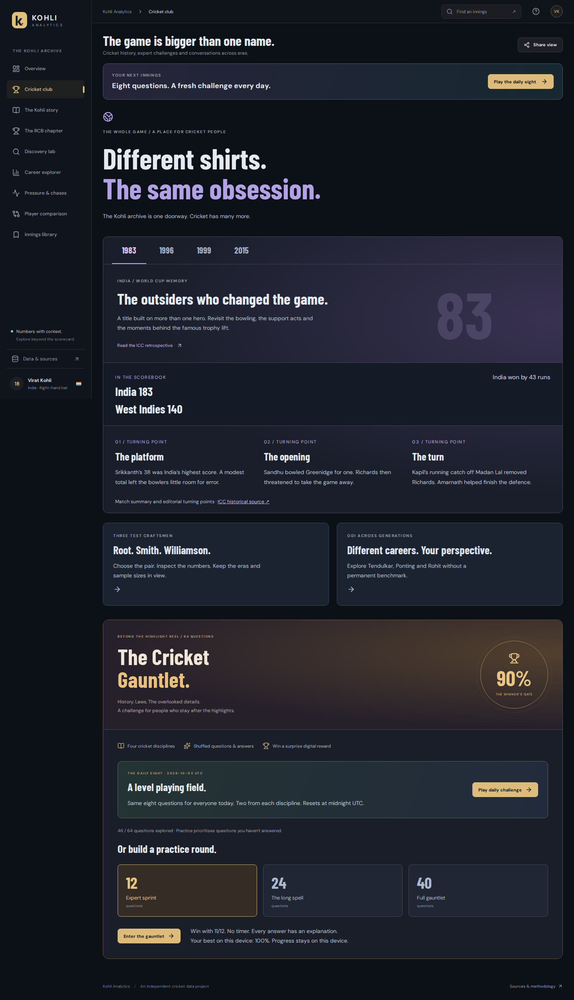
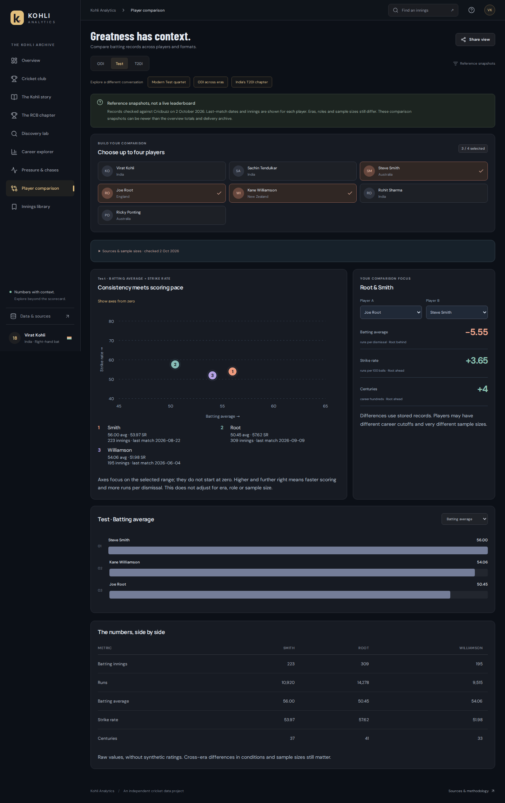
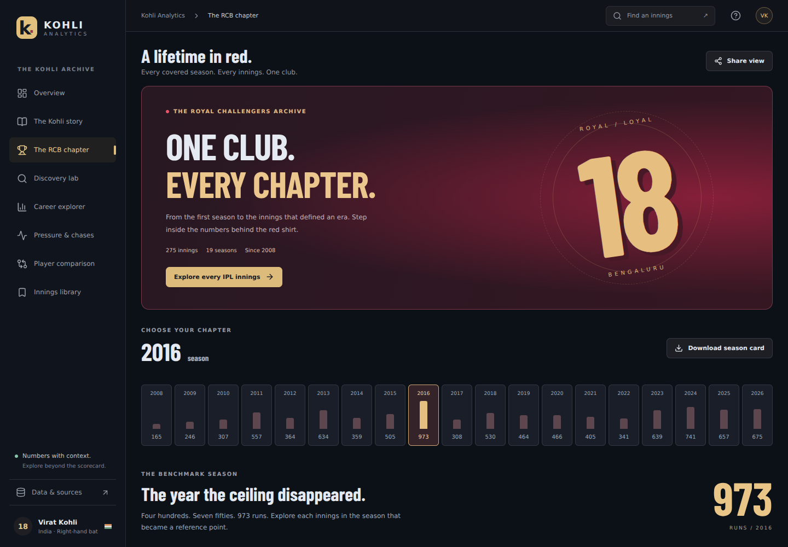
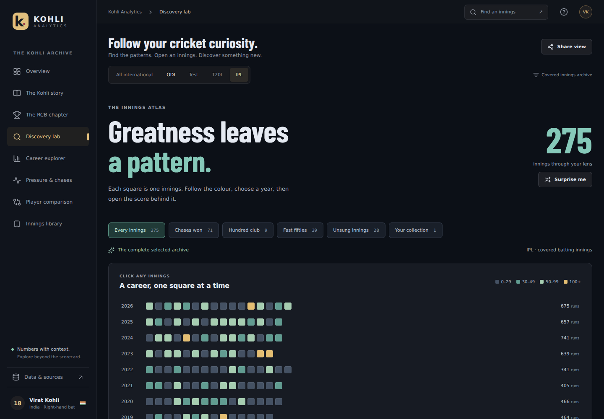
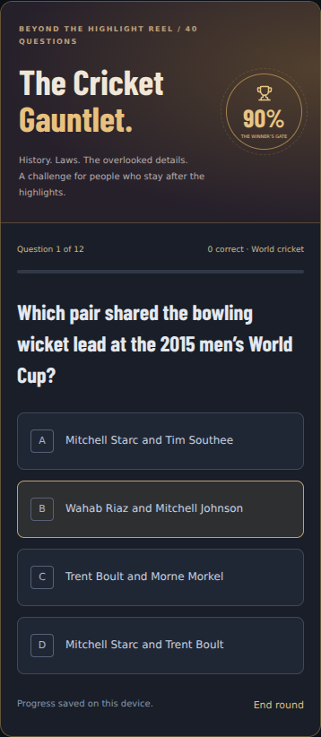

# 👑 Kohli Analytics

**A data-driven interactive experience for the greatest batter of his generation.**

[](https://github.com/rakeshkumar0804/kohli-analytics/actions/workflows/ci.yml) [](https://github.com/rakeshkumar0804/kohli-analytics/actions/workflows/auto-sync-stats.yml)      

🌐 **[Live Site → kohli-analytics.vercel.app](https://kohli-analytics.vercel.app)**

> Not just stats. A data-driven story told through original metrics, ball-by-ball situational pressure analysis, and verified multi-format datasets — every view dynamically recomputes populations, baselines, and distributions when you switch formats.

---

## 📸 Screenshots

Cricket Club (v7) | Flexible Player Comparison (v7) | The RCB Chapter
:---: | :---: | :---:
 |  | 

Discovery Lab | Daily & Practice Quiz on Mobile
:---: | :---:
 | 

---

## ⚡ What Makes This Different

Most cricket dashboards display static career tables copied from statistics portals. This application **engineers original metrics** directly from ball-by-ball delivery archives and scorecard populations.

### 🏏 Core Experiences (Revision 7)

- **🏏 Cricket Club & Daily Eight** — A shared deterministic UTC-day challenge with two questions per discipline, resume support, completed-result review, and a winner’s digital trophy for a perfect 8/8. Unseen-first practice rounds across 64 sourced questions.
- **🆚 Dated Comparison Snapshots** — Seven players across Test, ODI, and T20I with explicitly dated match cutoffs, innings counts, and direct source links. Numbered markers and a separate legend prevent name overlap; switch between focused and zero-based axes.
- **🏆 Enriched World Cup Chapters** — 1983, 1996, 1999, and 2015 chapters with match scorecards, three pivotal turning points per chapter, and ICC retrospective references.
- **📊 687 Innings Archive** — 300 ODI + 112 T20I + 275 IPL batting innings with searchable scorecards, bowler matchups, bookmarks, and CSV exports.
- **🔴 The RCB Chapter** — 19 IPL seasons with scoring phases, opposition breakdown, and downloadable season cards.
- **🔬 Discovery Lab** — Innings mosaic, scoring patterns, winning chases, centuries, and personal collection.
- **📖 The Kohli Story** — 5 career eras with checkpoint replays, innings comparison, captaincy analysis, and rivalry deep-dives.

### 📊 Analytics & Visualizations

- **Live Fixture Countdown** — Server-side CricAPI proxy with multi-strategy schedule discovery, rate limiting (30 req/min), and 15-min caching. Zero browser secret exposure.
- **15-Cell Pressure Map** — D3.js heatmap (Match Phase × Required Run Rate) across 6,889 ODI and 1,525 T20I chase deliveries with zero-dismissal null handling.
- **Clutch Index** — Bounded Hyperbolic Tangent normalization protected by 4 statistical trust gates. Displays `CALIBRATION PENDING` until all gates pass.
- **Pressure Dashboard** — Format-separated situational analysis: 4 high-leverage chase cards for ODI/T20I, 8 sourced splits for Test cricket.
- **Era Engine** — Interactive scrollytelling across 5 career eras (Youth → Rise → Peak → Drought → Renaissance) with dynamic chart morphing.
- **Chase Master** — Deep analysis of 165 ODI chases (88.29 winning chase average) with a horizontal defining chase gallery.
- **Legends Showdown** — 6-dimension normalized radar comparing Kohli vs Sachin, Ponting, Rohit, Smith, Root, and Williamson.
- **World Dominance Map** — D3-geo SVG world map with country-by-country career records against every Test nation.
- **Captaincy Myth Buster** — Verified Test captaincy win % (58.82%), 42 months at World No. 1, and overseas series records.

---

## 🏗️ Tech Stack

Layer | Technology
---|---
**Frontend** | React 19 · TypeScript 6 · Vite 8
**Typography** | Self-hosted DM Sans & Manrope variable fonts
**Animations** | GSAP 3.15 · Framer Motion 13 · Lenis (smooth scroll)
**Data Visualization** | D3.js 7 · Recharts 3 · TopoJSON
**Icons** | Lucide React
**Linting** | oxlint
**Deployment** | Vercel (auto-deploy on push to `main`)
**CI/CD** | GitHub Actions (CI + automated data sync)

---

## 📁 Project Structure

```
kohli-analytics/
├── .github/workflows/
│   ├── ci.yml                          # CI: test, lint, build on every push/PR
│   └── auto-sync-stats.yml            # Cron: twice-daily data refresh + auto-deploy
│
├── api/
│   └── fixtures.ts                     # Vercel serverless fixture proxy
│
├── data/
│   ├── manifests/                      # SHA-256 archive checksums
│   ├── derived/                        # Production analytics artifacts
│   ├── normalized/                     # Cleaned match data
│   ├── fixtures/                       # Missing reference matches
│   └── overrides/                      # ICC tournament stage maps
│
├── scripts/
│   ├── download-cricsheet.mjs          # Archive downloader with hash validation
│   ├── ingest-cricsheet.mjs            # Match filtering & delivery normalizer
│   ├── derive-kohli-analytics.mjs      # Pressure grids & chase analytics
│   ├── calibrate-clutch-index.mjs      # Bounded tanh calibration engine
│   ├── verify-derived-data.mjs         # Atomic write & integrity gate
│   ├── validate-data.mjs              # Cross-sum arithmetic validation
│   ├── test-analytics.mjs              # 158 unit & regression tests
│   ├── test-data-integration.mjs      # 31 independent oracle tests
│   ├── test-comparison-snapshots.mjs  # 21 comparison record provenance tests
│   ├── test-dashboard.mjs             # Dashboard route & filter tests
│   ├── test-cricket-quiz.mjs          # Daily & practice quiz lifecycle tests
│   ├── test-discovery.mjs             # Discovery lab tests
│   └── dashboard/                      # Browser verification harnesses
│
├── src/
│   ├── analytics/                      # Pure math calculators & adapters
│   ├── api/                            # Client API service
│   ├── components/
│   │   ├── Hero/                       # Animated hero with particles
│   │   ├── NextMatch/                  # Live fixture countdown
│   │   ├── PressureMap/                # D3 15-cell heatmap
│   │   ├── ClutchIndex/                # Calibration model
│   │   ├── EraEngine/                  # 5-era scrollytelling
│   │   ├── ChaseMaster/               # Chase analytics gallery
│   │   ├── LegendsShowdown/           # Radar comparison
│   │   ├── WorldMap/                   # D3-geo SVG map
│   │   ├── CaptaincyMyth/            # Captaincy analytics
│   │   ├── IPL/                        # RCB chapter
│   │   ├── DefiningInnings/           # Defining innings gallery
│   │   └── Layout/                     # Navbar & smooth scroll
│   ├── dashboard/                      # Cricket Club, Quiz, Story,
│   │                                   # Discovery, Archive, Comparison
│   ├── data/                           # Verified datasets & schemas
│   ├── server/                         # Fixtures service (server-only)
│   └── styles/                         # CSS design tokens
│
├── public/
│   ├── assets/                         # Static assets (topology, etc.)
│   └── fonts/                          # Self-hosted DM Sans & Manrope
│
├── vite.config.ts                      # Vite + local fixture proxy
├── tsconfig.json                       # Project references root
├── tsconfig.app.json                   # App config (bundler mode)
└── tsconfig.node.json                  # Node config (vite.config.ts)
```

---

## 🤖 Automated CI/CD & Data Sync

### Auto-Sync Pipeline

Career statistics stay automatically up-to-date without manual intervention:

```
Cron (08:30 IST & 20:30 IST)
    │
    ├── Download fresh Cricsheet archives
    ├── Ingest & normalize match data
    ├── Derive analytics artifacts
    ├── Verify mathematical invariants
    ├── Run full test suite (79 experience + 31 oracle tests)
    ├── Build production bundle
    ├── Auto-commit verified data
    └── Push to main → Vercel auto-deploys
```

- Runs **twice daily** via GitHub Actions cron + supports **1-click manual dispatch**
- Fetches open ball-by-ball archives from [Cricsheet](https://cricsheet.org/)
- Executes the complete pipeline: download → ingest → derive → calibrate → verify → test → build → deploy
- Only commits when new match data is detected

### CI Pipeline

Runs on every push and pull request:
- Derives and verifies analytics artifacts
- Runs unit tests + data integration tests + linting
- Builds production bundle + security audit

---

## 🏏 Live Fixture Architecture

```
Browser (Vite SPA)
    │
    └──► Serverless Proxy (/api/fixtures)
              │
              ├── Server-only credentials (never in client JS)
              ├── In-memory rate limiter (30 req/min per IP)
              ├── Bounded cache (15-min TTL)
              │
              ├── Strategy A: Series schedule discovery
              ├── Strategy B: Live / current matches
              └── Strategy C: Standalone matches fallback
                        │
                        └──► CricAPI Gateway
```

The UI distinguishes between `available`, `confirmed-empty`, `missing-credentials`, and `rate-limited` states — no misleading errors.

---

## 📊 Data Provenance

### Verified Career Totals

Format | Matches | Innings | Runs | Average | Centuries | Strike Rate
:---:|:---:|:---:|:---:|:---:|:---:|:---:
**Test** | 123 | 210 | 9,230 | 46.85 | 30 | —
**ODI** | 314 | 302 | 14,941 | 58.59 | 54 | 93.34
**T20I** | 125 | 117 | 4,188 | 48.70 | 1 | 137.04
**IPL** | 283 | 274 | 9,336 | 40.42 | 9 | 132.37

> Sources: [ESPNcricinfo Statsguru](https://stats.espncricinfo.com/ci/engine/player/253802.html) · [Cricbuzz](https://www.cricbuzz.com/profiles/1413/virat-kohli) · [Cricsheet](https://cricsheet.org/)

### Innings Archive

- **687 covered batting innings** — 300 ODI + 112 T20I + 275 IPL
- International totals exclude IPL unless explicitly selected
- Test delivery data is not included
- Coverage and source fingerprints are explained in the app

---

## 🛠️ Getting Started

### Prerequisites

- **Node.js** 22.12+ or Node 24
- **npm** 10+

### Quick Start

```bash
# Clone the repository
git clone https://github.com/rakeshkumar0804/kohli-analytics.git
cd virat-kohli-analytics

# Install dependencies
npm ci

# Start the development server
npm run dev
# → Open http://localhost:5173
```

### Optional: Live Fixture Feed

```bash
# Create .env.local with your CricAPI key (server-side only, never bundled)
echo "CRICKETDATA_API_KEY=your_api_key_here" > .env.local

# Restart dev server (.env changes require restart)
npm run dev
```

> All analytics work fully without fixture-provider credentials. The live fixture feed is optional.

---

## 🧪 Testing

```bash
# 79 focused dashboard, story, quiz, discovery, comparison & fixture tests
npm run test:experience

# 158 unit & mathematical regression tests across 12 suites
npm test

# 31 independent data integration & oracle tests
npm run test:data-integration

# Cross-sum arithmetic validation
npm run validate:data

# Lint (zero warnings policy)
npm run lint

# TypeScript + production build
npm run build
```

### Data Pipeline

```bash
npm run data:download       # Download Cricsheet archives
npm run data:ingest         # Filter & normalize deliveries
npm run data:derive         # Generate pressure grids & chase analytics
npm run clutch:calibrate    # Bounded tanh calibration
npm run data:verify         # Verify derived data integrity
npm run data:refresh        # Complete end-to-end pipeline
```

---

## 📜 License & Attribution

- **Source Code** — MIT License
- **Ball-by-Ball Data** — [Cricsheet](https://cricsheet.org/) by Stephen Rushe (CC-BY 4.0 / ODbL 1.0)
- **Career Aggregates** — ESPNcricinfo Statsguru & official public scorecards

---

> *"Pressure is a privilege. It means something is at stake."* — **Virat Kohli**
